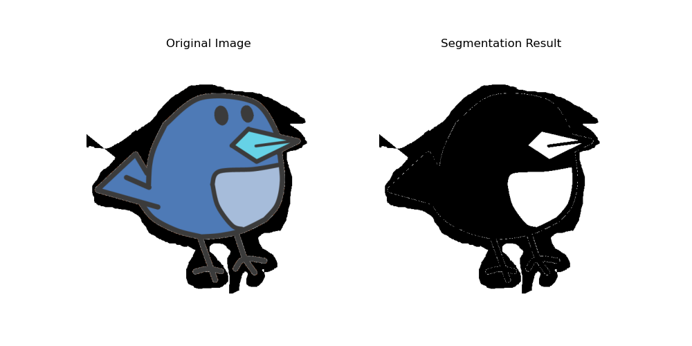

# 基于最大流最小割的图像分割实现
### 代码分析

```python
import numpy as np
import matplotlib.pyplot as plt
import networkx as nx
from skimage import img_as_ubyte, color
import cv2
```
这部分代码导入了所需的库，包括`numpy`用于数值计算，`matplotlib`用于绘图，`networkx`用于图操作，`skimage`用于图像处理，`cv2`用于图像读取和处理。

```python
def minimum_cut(graph, source, target):
    # 创建一个副本图，用于记录剩余容量
    residual_graph = nx.MultiDiGraph()

    # 初始化最小割的值为0
    min_cut_value = 0

    # 初始化可达节点集合
    reachable_nodes = set()

    # 添加源点和汇点到副本图中
    residual_graph.add_node(source)
    residual_graph.add_node(target)

    # 将原图中的边属性添加到副本图中
    for u, v, capacity in graph.edges(data='capacity'):
        residual_graph.add_edge(u, v, capacity=capacity)
        residual_graph.add_edge(v, u, capacity=0)  # 添加反向边

    # 使用广度优先搜索找到从源点到汇点的一条增广路径
    def bfs(node):
        queue = [node]
        while queue:
            node = queue.pop(0)
            if node not in visited:
                visited.add(node)
                for neighbor, attrs in residual_graph[node].items():
                    for attr in attrs.values():
                        if neighbor not in visited and attr['capacity'] > 0:
                            queue.append(neighbor)

    # 不断进行广度优先搜索，直到无法找到增广路径为止
    while True:
        # 初始化已访问节点集合
        visited = set()

        # 使用广度优先搜索找到一条增广路径
        bfs(source)

        # 如果汇点在已访问节点集合中，则存在增广路径
        if target in visited:
            # 找到增广路径上剩余容量最小的边
            min_residual_capacity = min(residual_graph[u][v][0]['capacity'] for u, v in nx.edge_dfs(residual_graph, source=source, orientation='reverse') if residual_graph.has_edge(u, v))

            # 遍历增广路径上的边，更新剩余容量
            for u, v in nx.edge_dfs(graph, source=source, orientation='reverse'):
                # 更新剩余容量
                if residual_graph.has_edge(u, v):
                    residual_graph[u][v]['capacity'] -= min_residual_capacity
                    if residual_graph[u][v]['capacity'] == 0:
                        residual_graph.remove_edge(u, v)
                if residual_graph.has_edge(v, u):
                    residual_graph[v][u]['capacity'] += min_residual_capacity
                    if residual_graph[v][u]['capacity'] == 0:
                        residual_graph.remove_edge(v, u)
            # 增加最小割的值
            min_cut_value += min_residual_capacity

            # 将可达节点添加到可达节点集合中
            reachable_nodes.update(visited)
        else:
            # 如果无法找到增广路径，则退出循环
            break

    # 不可达节点集合为所有节点减去可达节点集合
    non_reachable_nodes = set(graph.nodes) - reachable_nodes

    # 返回最小割的值和可达节点集合、不可达节点集合
    return min_cut_value, (reachable_nodes, non_reachable_nodes)
```
这部分代码定义了一个名为`minimum_cut`的函数，用于执行最小割算法。函数接收一个图`graph`、一个源节点`source`和一个目标节点`target`作为输入。函数首先创建一个副本图`residual_graph`，用于记录剩余容量。然后初始化最小割的值为0，可达节点集合为空集。接下来，将源节点和目标节点添加到副本图中，并将原图中的边属性添加到副本图中。之后，使用广度优先搜索找到从源节点到目标节点的一条增广路径，不断进行广度优先搜索，直到无法找到增广路径为止。如果目标节点在已访问节点集合中，则存在增广路径。找到增广路径上剩余容量最小的边，并遍历增广路径上的边，更新剩余容量。具体地，对于副本图中的每条边，如果边的容量大于0，则更新剩余容量，如果剩余容量为0，则移除该边。同时，更新最小割的值和将可达节点添加到可达节点集合中。如果无法找到增广路径，则退出循环。最后，计算不可达节点集合为所有节点减去可达节点集合，并返回最小割的值和可达节点集合、不可达节点集合。

```python
def graph_cut_segmentation(image):
    gray_image = img_as_ubyte(color.rgb2gray(image))
    g = nx.DiGraph()
    height, width = gray_image.shape
    nodes = np.arange(height * width).reshape((height, width))
    g.add_node('s')
    g.add_node('t')
    for i in range(height):
        for j in range(width):
            node_id = nodes[i, j]
            g.add_node(node_id)
            g.add_edge('s', node_id, capacity=gray_image[i, j])
            g.add_edge(node_id, 't', capacity=255 - gray_image[i, j])
            if i > 0:
                g.add_edge(node_id, nodes[i-1, j], capacity=1)
            if i < height - 1:
                g.add_edge(node_id, nodes[i+1, j], capacity=1)
            if j > 0:
                g.add_edge(node_id, nodes[i, j-1], capacity=1)
            if j < width - 1:
                g.add_edge(node_id, nodes[i, j+1], capacity=1)
    cut_value, partition = minimum_cut(g, 's', 't')
    reachable, non_reachable = partition
    segmented = np.zeros_like(gray_image)
    for node_id in reachable:
        if node_id != 's':
            i, j = np.unravel_index(node_id, (height, width))
            segmented[i, j] = 255
    return segmented
```
这部分代码定义了一个名为`graph_cut_segmentation`的函数，用于进行图像分割。函数接收一个图像`image`作为输入。首先，将图像转化为灰度图像，并创建一个有向图`g`。然后，获取灰度图像的高度和宽度，并根据像素的位置创建节点。接下来，将源节点`s`和汇点节点`t`添加到图中，并根据灰度值设置边的容量。同时，根据像素的位置添加相邻节点之间的边，并设置容量为1。然后，调用`minimum_cut`函数，传入图`g`、源节点`s`和汇点节点`t`，得到最小割的值和可达节点集合、不可达节点集合。最后，根据可达节点集合生成分割后的图像，并返回分割结果。

```python
images = ['./bird.png', './flower.png', './pokemon.png']
for image_path in images:
    image = cv2.imread(image_path)
    segmented = graph_cut_segmentation(image)
    fig, ax = plt.subplots(nrows=1, ncols=2, figsize=(10, 5))
    ax[0].imshow(image)
    ax[0].set_title('Original Image')
    ax[0].axis('off')
    ax[1].imshow(segmented, cmap='gray')
    ax[1].set_title('Segmentation Result')
    ax[1].axis('off')
    plt.show()
```
这部分代码定义了一个图像分割的示例。首先，定义了一个包含三个图像路径的列表。然后，对于每个图像路径，读取图像并调用`graph_cut_segmentation`函数进行图像分割。接下来，创建一个包含两个子图的图像展示窗口，并在第一个子图中显示原始图像，在第二个子图中显示分割结果。最后，显示图像展示窗口。

```python
images = ['./bird.png', './flower.png', './pokemon.png']
for _image in images:
    image = cv2.imread(_image)
    segmented = graph_cut_segmentation(image)
    fig, ax = plt.subplots(nrows=1, ncols=2, figsize=(10, 5))
    ax[0].imshow(image)
    ax[0].set_title('Original Image')
    ax[0].axis('off')
    ax[1].imshow(segmented, cmap='gray')
    ax[1].set_title('Segmentation Result')
    ax[1].axis('off')
    plt.show()
```
这部分代码定义了一个列表`images`，包含了三个图像文件的路径。

然后，使用`for`循环遍历`images`列表，依次读取每个图像文件。

接着，调用`graph_cut_segmentation`函数对读取的图像进行分割，得到分割结果。

然后，使用`matplotlib.pyplot`库创建一个图像显示窗口，其中`ax[0]`显示原始图像，`ax[1]`显示分割结果。

最后，调用`plt.show()`函数显示图像窗口，展示原始图像和分割结果。
### 输出截图

- Figure_1.png

- Figure_2.png

- Figure_3.png


### 源代码
```python
import numpy as np
import matplotlib.pyplot as plt
import networkx as nx
from skimage import img_as_ubyte, color
import cv2

def minimum_cut(graph, source, target):
    # 创建一个副本图，用于记录剩余容量
    residual_graph = nx.MultiDiGraph()

    # 初始化最小割的值为0
    min_cut_value = 0

    # 初始化可达节点集合
    reachable_nodes = set()

    # 添加源点和汇点到副本图中
    residual_graph.add_node(source)
    residual_graph.add_node(target)

    # 将原图中的边属性添加到副本图中
    for u, v, capacity in graph.edges(data='capacity'):
        residual_graph.add_edge(u, v, capacity=capacity)
        residual_graph.add_edge(v, u, capacity=0)  # 添加反向边


    # 使用广度优先搜索找到从源点到汇点的一条增广路径
    def bfs(node):
        queue = [node]
        while queue:
            node = queue.pop(0)
            if node not in visited:
                visited.add(node)
                for neighbor, attrs in residual_graph[node].items():
                    for attr in attrs.values():
                        if neighbor not in visited and attr['capacity'] > 0:
                            queue.append(neighbor)

    # 不断进行广度优先搜索，直到无法找到增广路径为止
    while True:
        # 初始化已访问节点集合
        visited = set()

        # 使用广度优先搜索找到一条增广路径
        bfs(source)

        # 如果汇点在已访问节点集合中，则存在增广路径
        if target in visited:
            # 找到增广路径上剩余容量最小的边
            min_residual_capacity = min(residual_graph[u][v][0]['capacity'] for u, v in nx.edge_dfs(residual_graph, source=source, orientation='reverse') if residual_graph.has_edge(u, v))

            # 遍历增广路径上的边，更新剩余容量
            for u, v in nx.edge_dfs(graph, source=source, orientation='reverse'):
                # 更新剩余容量
                if residual_graph.has_edge(u, v):
                    residual_graph[u][v]['capacity'] -= min_residual_capacity
                    if residual_graph[u][v]['capacity'] == 0:
                        residual_graph.remove_edge(u, v)
                if residual_graph.has_edge(v, u):
                    residual_graph[v][u]['capacity'] += min_residual_capacity
                    if residual_graph[v][u]['capacity'] == 0:
                        residual_graph.remove_edge(v, u)
            # 增加最小割的值
            min_cut_value += min_residual_capacity

            # 将可达节点添加到可达节点集合中
            reachable_nodes.update(visited)
        else:
            # 如果无法找到增广路径，则退出循环
            break

    # 不可达节点集合为所有节点减去可达节点集合
    non_reachable_nodes = set(graph.nodes) - reachable_nodes

    # 返回最小割的值和可达节点集合、不可达节点集合
    return min_cut_value, (reachable_nodes, non_reachable_nodes)

def graph_cut_segmentation(image):
    gray_image = img_as_ubyte(color.rgb2gray(image))
    g = nx.DiGraph()
    height, width = gray_image.shape
    nodes = np.arange(height * width).reshape((height, width))
    g.add_node('s')
    g.add_node('t')
    for i in range(height):
        for j in range(width):
            node_id = nodes[i, j]
            g.add_node(node_id)
            g.add_edge('s', node_id, capacity=gray_image[i, j])
            g.add_edge(node_id, 't', capacity=255 - gray_image[i, j])
            if i > 0:
                g.add_edge(node_id, nodes[i-1, j], capacity=1)
            if i < height - 1:
                g.add_edge(node_id, nodes[i+1, j], capacity=1)
            if j > 0:
                g.add_edge(node_id, nodes[i, j-1], capacity=1)
            if j < width - 1:
                g.add_edge(node_id, nodes[i, j+1], capacity=1)
    cut_value, partition = minimum_cut(g, 's', 't')
    reachable, non_reachable = partition
    segmented = np.zeros_like(gray_image)
    for node_id in reachable:
        if node_id != 's':
            i, j = np.unravel_index(node_id, (height, width))
            segmented[i, j] = 255
    return segmented

images = ['./bird.png', './flower.png', './pokemon.png']
for image_path in images:
    image = cv2.imread(image_path)
    segmented = graph_cut_segmentation(image)
    fig, ax = plt.subplots(nrows=1, ncols=2, figsize=(10, 5))
    ax[0].imshow(image)
    ax[0].set_title('Original Image')
    ax[0].axis('off')
    ax[1].imshow(segmented, cmap='gray')
    ax[1].set_title('Segmentation Result')
    ax[1].axis('off')
    plt.show()

```